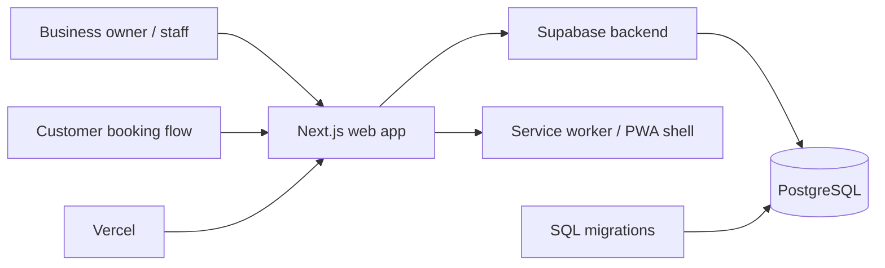
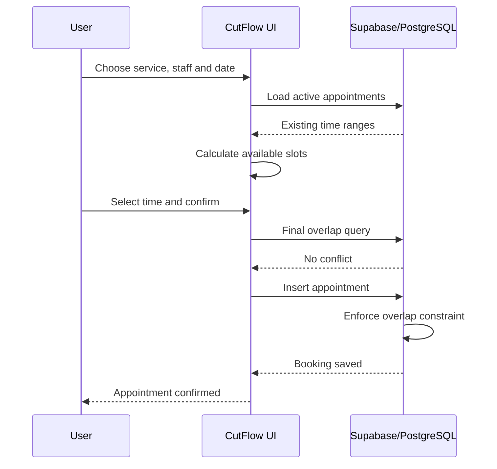

# CutFlow

**A full-stack salon and barber operations platform built around reliable booking, staff scheduling, customer privacy and day-to-day business management.**

**Live product:** https://cutflow.co.za

CutFlow is the flagship software project in my portfolio. It is designed for salons, barbers and similar appointment-based businesses that need one system for bookings, staff, customers, services and operational workflows.

---

## Why I built it

Appointment-based businesses often manage bookings, staff availability, payments and customer information across multiple disconnected tools.

CutFlow brings those workflows together in one application with a stronger focus on the problems that appear once a system moves beyond a prototype:

- preventing two customers from booking the same staff member at the same time;
- keeping staff availability accurate while multiple users are active;
- handling South African calendar dates correctly;
- protecting customer information after a service is completed;
- supporting an installable/offline-capable experience without caching sensitive customer records;
- managing SaaS trial behaviour without affecting already-paid customers.

The project has been developed iteratively, with database migrations and release-specific fixes added as real product requirements became clearer.

---

## Core product capabilities

CutFlow currently includes:

- appointment scheduling and rescheduling;
- staff working hours and service assignments;
- live slot availability;
- branches;
- customers and services;
- appointment status workflows;
- POS and payment-status workflows;
- inventory;
- memberships;
- vouchers;
- commissions;
- reporting;
- a one-month SaaS trial;
- installable PWA/offline shell;
- customer-data privacy rules;
- Vercel deployment.

---

## Tech stack

| Layer | Technology |
| --- | --- |
| Frontend | Next.js 16, React 19 |
| Backend/data | Supabase, PostgreSQL |
| Hosting | Vercel |
| Offline/PWA | Service worker + web app manifest |
| Runtime | Node.js 22 |
| Version control | Git + GitHub |

---

## System architecture



The application keeps booking rules in both the client experience and the database. The UI tries to prevent invalid choices early, while PostgreSQL remains the final source of truth for appointment integrity.

---

## Engineering case study

### 1. Preventing double bookings

A booking system cannot rely only on hiding unavailable buttons in the browser. Two people can load the same free slot at the same time and submit seconds apart.

CutFlow handles this at multiple layers.

**Client-side availability**

The appointments screen:

- loads the selected staff member's appointments for the chosen day;
- calculates open times from service duration and working hours;
- removes times that conflict with active appointments;
- refreshes availability every 15 seconds while the page is active;
- refreshes again when the browser regains focus;
- performs a final overlap check immediately before saving.

**Database-level protection**

The database migration adds a PostgreSQL exclusion constraint:

```sql
exclude using gist (
  staff_id with =,
  tstzrange(starts_at, ends_at, '[)') with &&
)
where (status not in ('cancelled', 'no_show'));
```

That means two active appointments for the same staff member cannot occupy overlapping time ranges, even if concurrent requests bypass the browser checks.

If PostgreSQL rejects a conflicting insert, CutFlow catches the constraint error and tells the user that the slot became unavailable.

**Engineering lesson:** availability is a user-experience concern; booking integrity is a database concern. The application uses both.

---

### 2. Handling South African booking dates correctly

Date handling can fail when the server, database and browser interpret "today" in different time zones.

CutFlow's booking migration updates its public slot and booking functions so day boundaries use:

```sql
(now() at time zone 'Africa/Johannesburg')::date
```

The appointment screen also creates daily boundaries using the South African UTC+02:00 offset when querying bookings.

This reduces cases where a valid local booking date could incorrectly roll into the previous or next day because of server timezone differences.

---

### 3. Customer privacy after service completion

CutFlow's v0.12.4 privacy work treats completed-service identity differently from operational reporting data.

The current rules are designed so that:

- walk-ins do not create permanent CRM customer profiles;
- walk-in names, phone numbers and notes are removed when service is completed;
- completed appointments detach customer identity and clear appointment notes;
- a customer profile is de-identified after its final active booking/queue relationship is completed;
- anonymous operational information such as service, staff, time, price and payment status can remain available for reporting;
- active customer selectors exclude anonymized records.

This separates the information needed to operate and report on the business from personal information that no longer needs to remain attached.

---

### 4. Offline capability without unsafe offline writes

CutFlow is installable as a PWA and keeps a self-contained offline screen plus static application assets after the first online visit.

The offline model deliberately **does not** cache customer data or API responses.

Bookings, subscriptions, payments and business-record changes require a live connection. CutFlow also does not queue offline financial or booking transactions.

This was a deliberate engineering trade-off: an offline shell improves resilience, but stale appointment data could create double bookings and cached customer data would increase privacy risk.

---

### 5. Safely upgrading the SaaS trial

CutFlow originally used a seven-day trial. The upgrade migration changes new trials to one calendar month and extends only standard unpaid seven-day trials.

Paid subscriptions and custom trial periods retain their existing expiry values.

The migration is designed to be safe to rerun and checks the existing subscription-trigger definition before modifying it.

---

## Appointment workflow



---

## Repository and deployment model

The production application is deployed through Vercel.

This repository uses a deterministic bootstrap process:

1. Vercel runs `bootstrap.sh`.
2. The base Next.js source is reconstructed from the stored source parts.
3. Release-specific updates are applied.
4. Pinned dependencies are installed.
5. Next.js builds the production application.

Deployment configuration also sets explicit caching behaviour for the service worker and web-app manifest.

---

## Database migrations

Important upgrade scripts currently include:

- `supabase/UPGRADE_ONE_MONTH_TRIAL.sql` — changes standard trials from seven days to one month without altering paid/custom subscriptions.
- `supabase/UPGRADE_V12_3_BOOKED_SLOTS.sql` — adds database-level staff overlap protection and South African date handling.

Migrations are kept separate from application code so existing deployments can be upgraded intentionally rather than depending on silent schema changes.

---

## Offline behaviour

See [OFFLINE_MODE.md](./OFFLINE_MODE.md) for the operational rules used by the PWA.

The key principle is simple:

> Static app availability can work offline; business records that require fresh shared state stay online-only.

---

## Production configuration

The Vercel environment requires:

```text
NEXT_PUBLIC_SUPABASE_URL
NEXT_PUBLIC_SUPABASE_ANON_KEY
```

Additional server-only production secrets remain in the hosting environment and must never be committed to GitHub.

The repository's `.gitignore` excludes environment files, keys, certificates and build output.

---

## What this project demonstrates

CutFlow demonstrates more than building screens. It shows my experience working through problems that matter in production software:

- full-stack product development;
- relational business workflows;
- PostgreSQL data-integrity constraints;
- concurrent-booking protection;
- timezone-aware scheduling;
- privacy-conscious data lifecycle design;
- PWA/offline trade-offs;
- SaaS subscription migrations;
- deployment configuration;
- iterative debugging and release maintenance.

---

## Current release

**v0.12.4**

The current release focuses on customer privacy while retaining the existing booking, staff, POS, inventory, membership, voucher, commission, trial and offline capabilities.

---

## Author

**Xolo Dlamini**  
Software Developer · Founder of Isiphosendalo Solutions

- GitHub: https://github.com/Itx108
- Portfolio: https://github.com/Itx108/Xolo-s-Portfolio
- LinkedIn: https://www.linkedin.com/in/xolo-dlamini-74066734b
